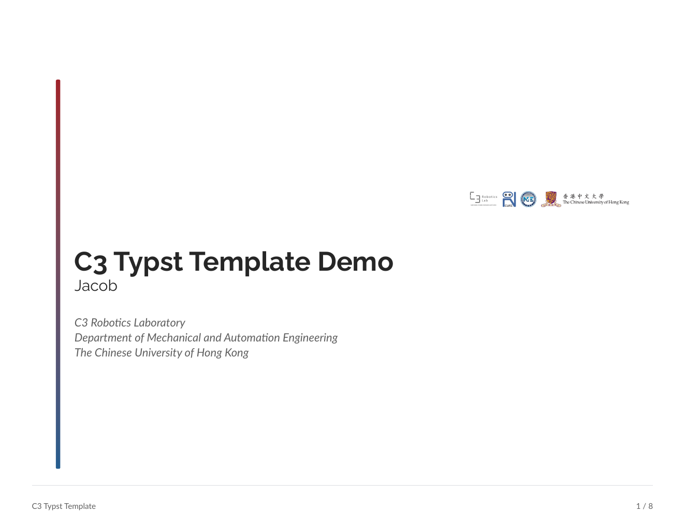
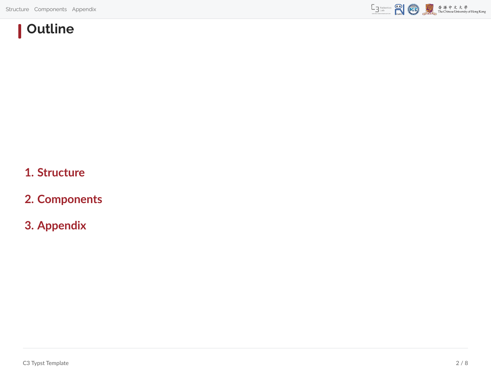
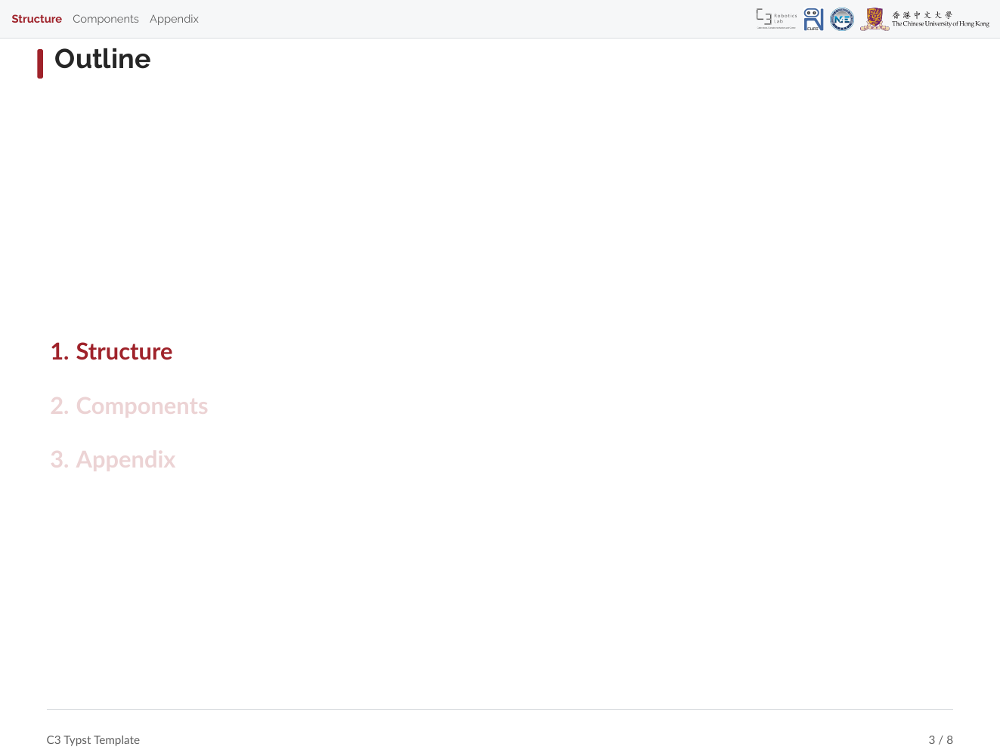
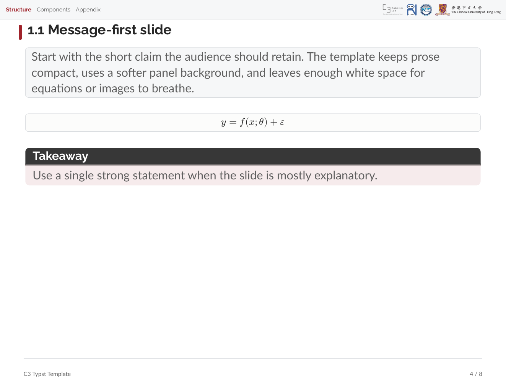
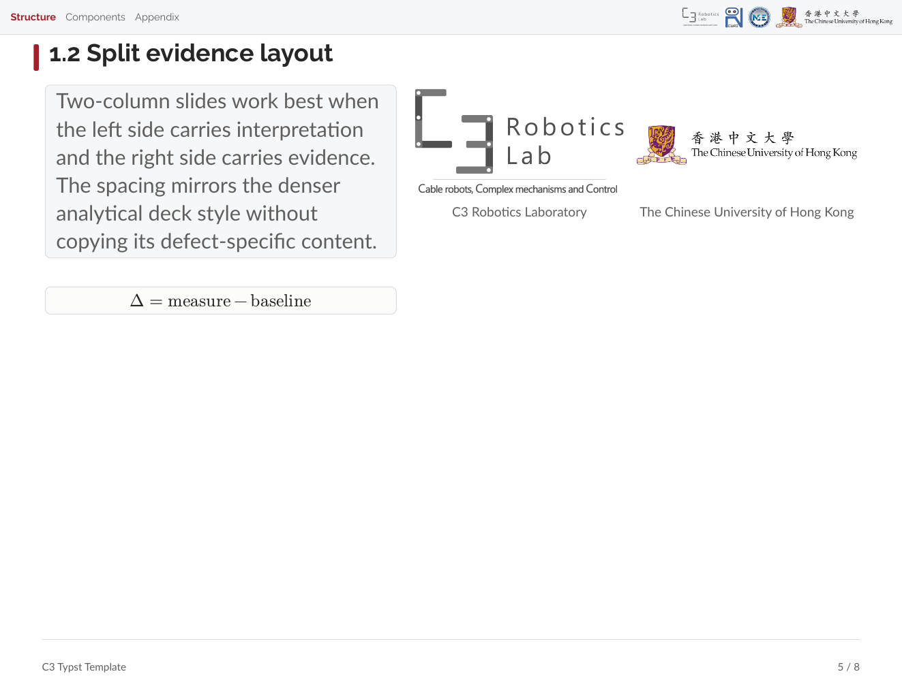
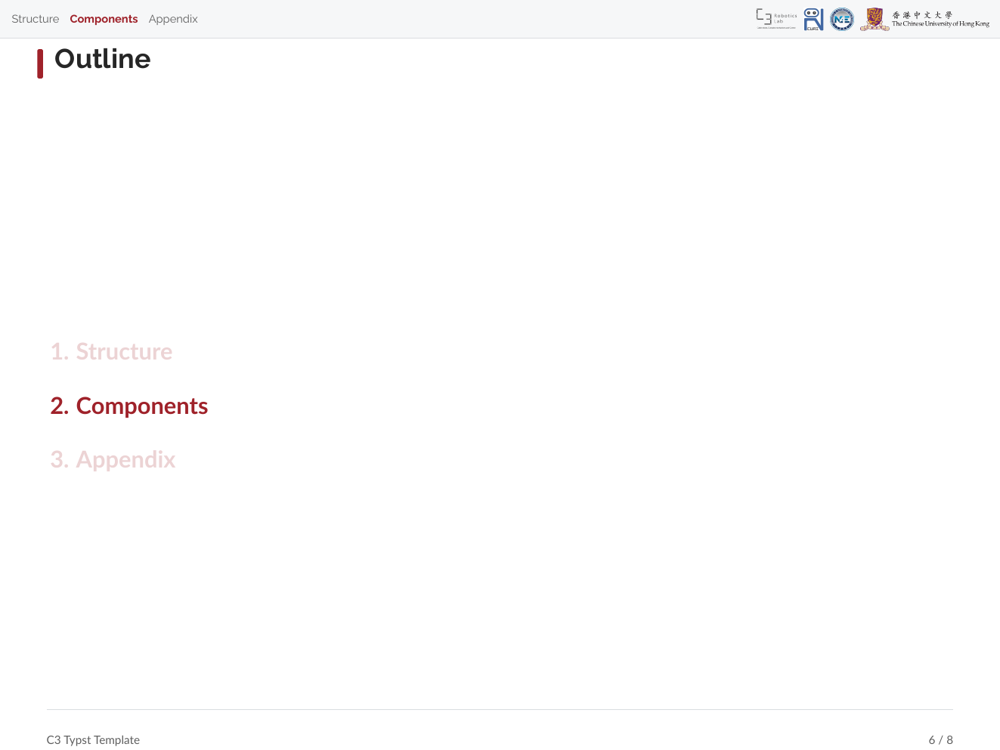
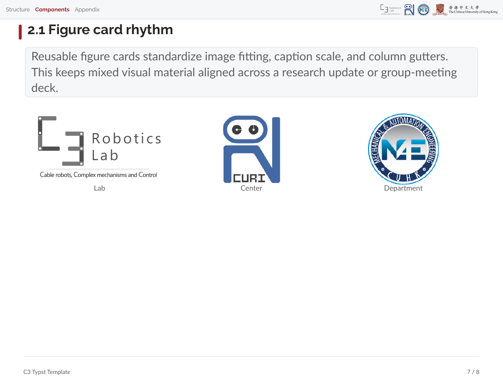
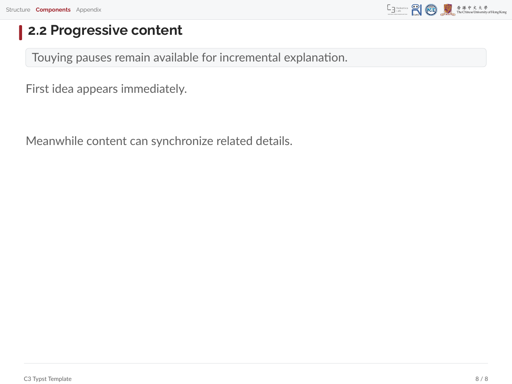

# c3_typst_template

[](https://github.com/jacobleft/c3_typst_template/actions/workflows/build-demo.yml)

A Touying-based Typst presentation theme with a small demo deck.

## Demo Slides

| | |
|---|---|
|  |  |
|  |  |
|  |  |
|  |  |

## Contents

- `c3_typst_template.typ` - reusable slide theme
- `c3_typst_template_example.typ` - demo presentation
- `c3_template_media/` - logo assets referenced by the theme
- `docs/demo-slides/` - rendered PNG preview slides

## Build The Demo

```bash
typst compile c3_typst_template_example.typ
```

GitHub Actions also compiles the demo on every push and pull request to `main`.
The compiled PDF is uploaded as the `c3_typst_template_example` workflow artifact.

The example imports the theme directly:

```typst
#import "c3_typst_template.typ": *

#show: c3-theme.with(
  aspect-ratio: "4-3",
  config-info(
    title: [C3 Typst Template Demo],
    author: [Jacob],
    institution: [C3 Robotics Laboratory],
  ),
)
```

## Reusable Components

The theme exports a compact set of slide helpers:

- `#title-slide()` - C3-branded title slide
- `#outline-slide()` - section outline slide
- `#focus-slide[...]` - full-slide emphasis
- `#text-panel[...]` - soft explanatory panel
- `#eq-panel[...]` - centered equation panel
- `#fig-card(...)`, `#pair-card(...)`, `#triple-card(...)` - image cards with consistent captions and gutters
- `#tblock(title: ...)[...]` - titled callout block

## Requirements

- Typst
- Typst packages fetched from the preview registry:
  - `@preview/touying:0.7.3`
  - `@preview/numbly:0.1.0`

## Notes

This repository contains the presentation template and demo only.
